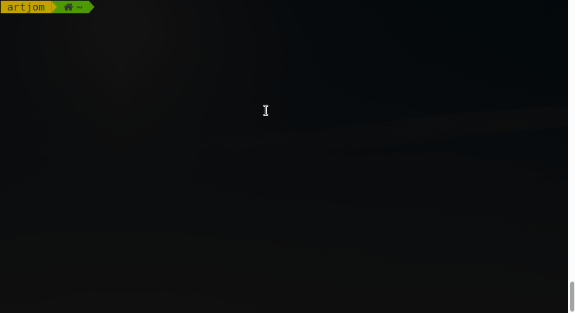

# SearchLongMethodNamesInJavaFilesOfProjectDirectories


[](https://www.gnu.org/software/bash/)


Simple bash script to recognize long method names in java source files 



## Getting started
### Installation
1. Clone the repo 
    ```bash
    $ git clone https://github.com/lell170/searchLongMethodNamesInJavaFilesOfProjectDirectories.git
    ```
2. Change into cloned directory
    ```bash
    $ cd searchLongMethodNamesInJavaFilesOfProjectDirectories
    ```
3. Install repo by running installation script
    ```bash
    $ sudo sh -c 'chmod +x install.sh && ./install.sh'
    ```
   
## Usage 
    longmethods -d <path to java project directory>

## Options
    -d, --directory (*requiered option for project directory)
    -l, --limit (limit of results)
    -f, --isLongFrom ( (chars count) definition for a long method)

## Licence
Distributed under the MIT License. See `LICENSE` for more information.
